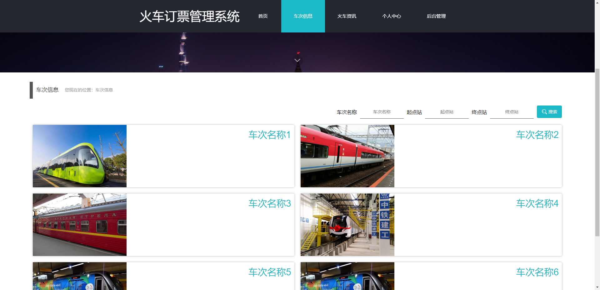
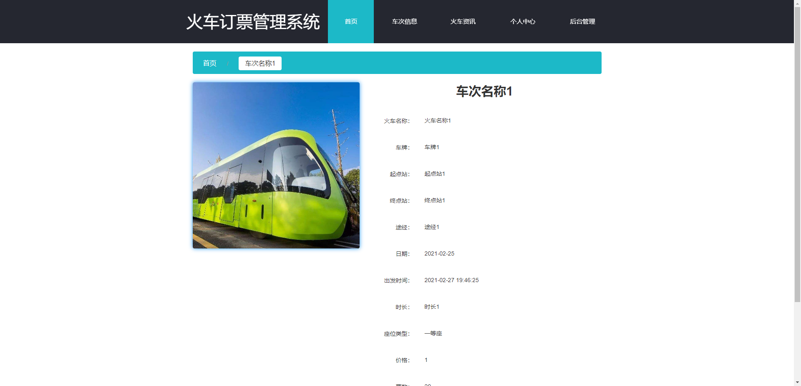
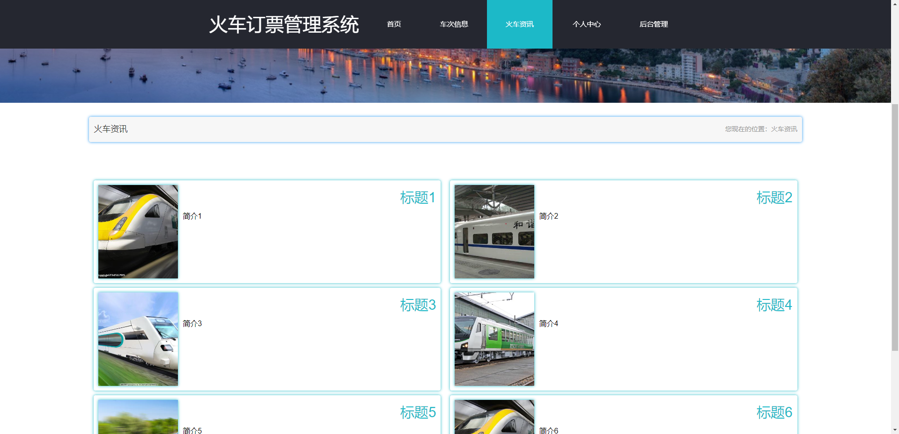
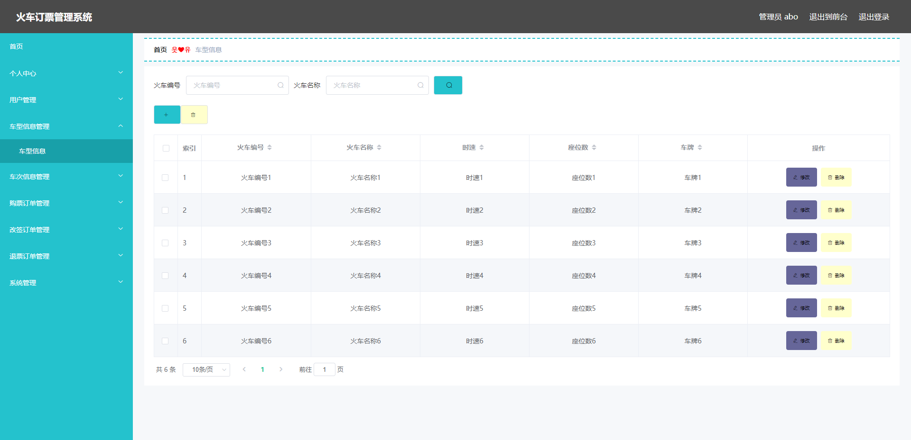
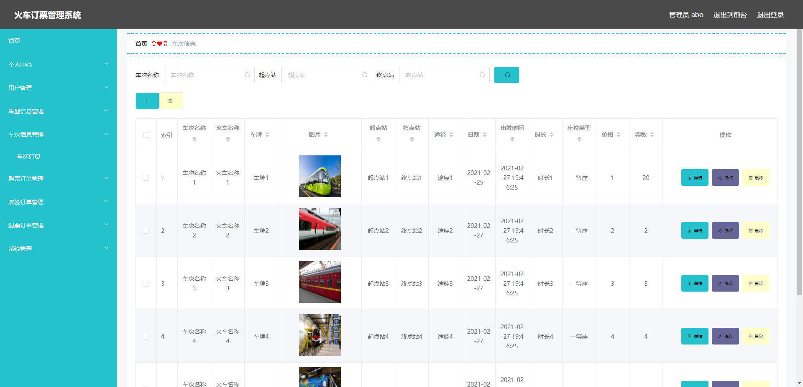
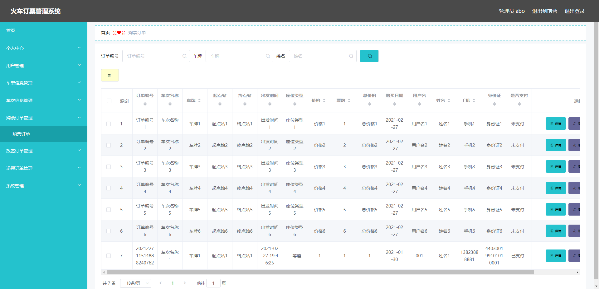
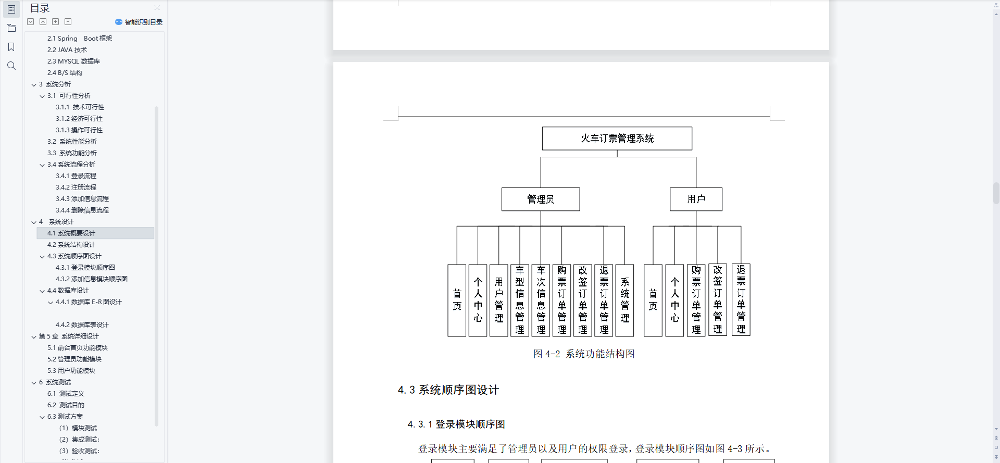
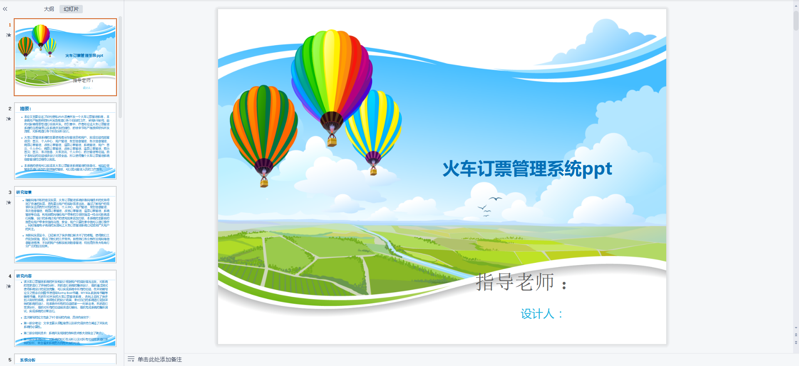
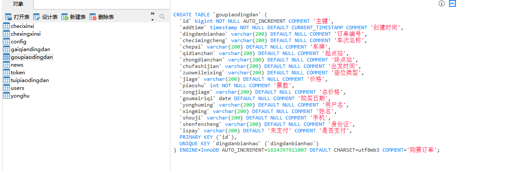

# 1 项目介绍
基于SSM+Vue的火车售票系统：后端 SpringBoot、Mybatis-Plus，前端Vue+ElementUI，具体功能如下：
## 管理员
- 个人中心：查看和修改个人信息、修改密码
- 用户管理
- 车型信息管理
- 车次信息管理
- 购票订单管理
- 改签订单管理
- 退票订单管理
- 系统管理(火车资讯、轮播图管理)
## 用户
- 个人中心：查看和修改个人信息、修改密码
- 购票订单管理
- 改签订单管理
- 退票订单管理
- 前台功能(查看车次、查看资讯、个人信息)
# 2 系统运行截图
## 2.1 用户登录

## 2.2 车次信息

## 2.3 车次详情

## 2.4 货车资讯

## 2.5 车型信息

## 2.6 车次信息

## 2.7 购票订单

## 2.8 万字文档

## 2.9 ppt

# 3 数据库

# 4 源码数据库获取(收费)

